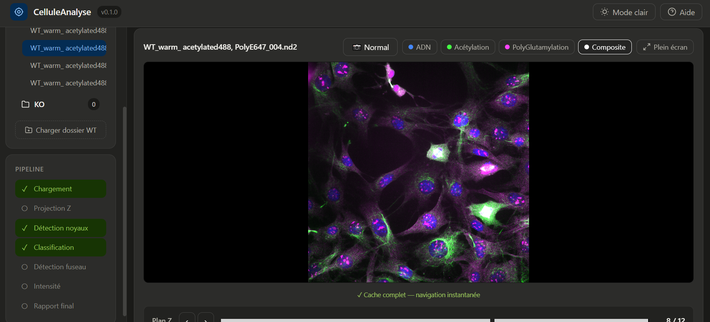

# CelluleAnalyse 🔬

A modular, containerized web platform for automated fluorescence microscopy image analysis.


---

## 📋 Overview

**CelluleAnalyse** is a production-ready web platform for automated analysis of fluorescence microscopy images (`.nd2`, `.czi`, `.tiff`). It provides a complete pipeline from image loading to statistical reporting, with a modular architecture that supports multiple detection methods — from classical thresholding to deep learning.

| Feature | Description | Status |
|---------|-------------|--------|
| 🔵 Nucleus detection | Automated detection from DAPI/DNA channel | ✅ Stable |
| 🔬 Cell classification | Interphase vs mitosis classification | ✅ Stable |
| 📊 Fluorescence measurement | Intensity quantification in mitotic spindles | 🔄 In development |
| 📈 Group comparison | Statistical comparison between two conditions | 🔄 In development |
| 🧠 ML/DL detection | Cellpose, StarDist integration | 🔄 In development |

---

## 🚀 Quick Start — For End Users (No coding required)

> ⚠️ **Only Docker Desktop is required — no Python, no Node.js, no source code needed.**

### Step 1 — Install Docker Desktop

Download and install **[Docker Desktop](https://www.docker.com/products/docker-desktop)** for your OS.

### Step 2 — Download the 3 launcher files

Download only these 3 files from the [`deploy/`](https://github.com/Millimono/CelluleAnalyse/tree/main/deploy) folder:

| File | For |
|------|-----|
| [`docker-compose.yml`](https://github.com/Millimono/CelluleAnalyse/blob/main/deploy/docker-compose.yml) | All OS |
| [`lancer.bat`](https://github.com/Millimono/CelluleAnalyse/blob/main/deploy/lancer.bat) | Windows only |
| [`lancer.sh`](https://github.com/Millimono/CelluleAnalyse/blob/main/deploy/lancer.sh) | Mac / Linux only |

Put all 3 files in the **same folder**.

### Step 3 — Organize your images

Your images must be organized in subfolders like this:

```
MyImagesFolder/
    WT/
        image1.nd2
        image2.nd2
    MAP6_KO/
        image1.nd2
        image2.nd2
```

> The subfolder names can be anything — WT, KO, Control, Treatment, etc.

### Step 4 — Launch the app

**Windows:**
```
Double-click lancer.bat
```
Enter the path to your images folder when prompted (e.g. `E:\MyLab\Images`).

**Mac / Linux:**
```bash
chmod +x lancer.sh
./lancer.sh
```
Enter the path to your images folder when prompted (e.g. `/Users/marie/Images`).

The app will:
1. Download the Docker images automatically (~500MB, first launch only)
2. Start the application
3. Open **http://localhost** in your browser

### Step 5 — Use the app

1. Click **"Load WT folder"** → enter the full path to your first group (e.g. `E:\MyLab\Images\WT`)
2. Click **"Load KO folder"** → enter the full path to your second group
3. Click on any file to visualize it
4. Navigate channels and Z-planes
5. Launch analysis from the **Analysis panel**

---

## 🐳 Docker Hub Images

The application is available as pre-built Docker images:

| Image | Link |
|-------|------|
| Backend (FastAPI) | [`smill/celluleanalyse-backend:v0.1.0`](https://hub.docker.com/r/smill/celluleanalyse-backend) |
| Frontend (React/Nginx) | [`smill/celluleanalyse-frontend:v0.1.0`](https://hub.docker.com/r/smill/celluleanalyse-frontend) |

Pull manually if needed:
```bash
docker pull smill/celluleanalyse-backend:v0.1.0
docker pull smill/celluleanalyse-frontend:v0.1.0
```

---

## 📸 Screenshots

> Dashboard with image viewer, pipeline status, and analysis configuration



---

## 🏗️ Architecture

```
CelluleAnalyse/
├── backend/                          # FastAPI Python backend
│   ├── api/
│   │   ├── routes_chargement.py      # File loading routes
│   │   ├── routes_visualisation.py   # Image rendering routes
│   │   ├── routes_analyse.py         # Analysis routes
│   │   └── routes_rapport.py         # Report generation (coming soon)
│   ├── modules/
│   │   ├── chargement/
│   │   │   ├── loader_nd2.py         # Nikon .nd2 reader
│   │   │   ├── loader_czi.py         # Zeiss .czi reader (coming soon)
│   │   │   └── projection_z.py       # 3D to 2D Z-projection (max/mean/sum)
│   │   ├── detection_noyaux/
│   │   │   ├── base_detector.py      # Abstract detector interface
│   │   │   ├── detector_threshold.py # Otsu thresholding + watershed
│   │   │   ├── detector_cellpose.py  # Cellpose ML (coming soon)
│   │   │   └── detector_stardist.py  # StarDist DL (coming soon)
│   │   ├── classification/
│   │   │   ├── base_classifier.py    # Abstract classifier interface
│   │   │   ├── classifier_shape.py   # Geometric shape classifier
│   │   │   ├── classifier_ml.py      # ML classifier (coming soon)
│   │   │   └── classifier_dl.py      # DL classifier (coming soon)
│   │   ├── detection_fuseau/
│   │   │   ├── base_fuseau.py        # Abstract spindle detector
│   │   │   ├── fuseau_threshold.py   # Threshold-based detection
│   │   │   └── fuseau_ml.py          # ML-based detection (coming soon)
│   │   ├── intensite/
│   │   │   └── mesure_intensite.py   # Fluorescence intensity measurement
│   │   └── statistiques/
│   │       ├── stats_comparaison.py  # WT vs KO statistical comparison
│   │       └── rapport_generator.py  # HTML/PDF report generation
│   ├── cache_shared.py               # Shared in-memory cache
│   ├── main.py                       # FastAPI app entry point
│   └── requirements.txt
│
├── frontend/                         # React frontend
│   └── src/
│       ├── components/
│       │   ├── layout/               # Header, Sidebar, MainContent
│       │   ├── groups/               # Group loader and file list
│       │   ├── pipeline/             # Pipeline status tracker
│       │   ├── viewer/               # Image viewer, channel selector, Z-slider
│       │   ├── metrics/              # Metric cards and grid
│       │   ├── files/                # File list component
│       │   └── analysis/             # Method selector and config panel
│       ├── api/                      # Backend API calls
│       ├── context/                  # Global app state (AppContext)
│       └── styles/                   # CSS variables (light/dark theme)
│
├── deploy/                           # End-user distribution files
│   ├── docker-compose.yml            # Production docker-compose
│   ├── lancer.bat                    # Windows launcher
│   └── lancer.sh                     # Mac/Linux launcher
│
├── Dockerfile.backend
├── Dockerfile.frontend
├── docker-compose.yml                # Development docker-compose
├── nginx.conf
└── README.md
```

---

## 🔬 Supported Image Formats

| Format | Manufacturer | Status |
|--------|-------------|--------|
| `.nd2` | Nikon | ✅ Supported |
| `.czi` | Zeiss | 🔄 Coming soon |
| `.tiff` | Universal | 🔄 Coming soon |
| `.lif` | Leica | 🔄 Coming soon |
| `.oib` | Olympus | 🔄 Coming soon |

---

## 🧠 Detection Methods

| Module | Method | Status |
|--------|--------|--------|
| Nucleus detection | Otsu thresholding + Watershed | ✅ Available |
| Nucleus detection | Cellpose (ML) | 🔄 Coming soon |
| Nucleus detection | StarDist (DL) | 🔄 Coming soon |
| Nucleus detection | Custom model (YOLO/fine-tuned) | 🔄 Coming soon |
| Classification | Geometric shape (circularity) | ✅ Available |
| Classification | Classical ML | 🔄 Coming soon |
| Classification | Deep Learning | 🔄 Coming soon |
| Spindle detection | Threshold-based | 🔄 Coming soon |
| Spindle detection | ML-based | 🔄 Coming soon |

---

## 💻 Local Development

### Backend

```bash
cd backend
pip install -r requirements.txt
python -m uvicorn main:app --reload
# http://localhost:8000
# http://localhost:8000/docs (Swagger UI)
```

### Frontend

```bash
cd frontend
npm install
npm run dev
# http://localhost:5173
```

### Build Docker images locally

```bash
docker-compose build
docker-compose up -d
```

---

## 🛠️ Technical Stack

| Category | Technology | Version |
|----------|-----------|---------|
| Backend framework | FastAPI | 0.128 |
| ASGI server | Uvicorn | 0.39 |
| Image reading | nd2 | 0.11 |
| Image processing | scikit-image | 0.21 |
| Numerical computing | NumPy | 1.26 |
| Data analysis | Pandas | 2.0 |
| Visualization | Matplotlib, Seaborn | 3.7, 0.12 |
| Frontend framework | React | 18 |
| Build tool | Vite | 8 |
| HTTP client | Axios | 1.4 |
| Web server | Nginx | 1.27 |
| Containerization | Docker + Compose | 28.x |
| Languages | Python, JavaScript, CSS | 3.11, ES2022 |

---

## 📊 Use Case

This platform was developed for the analysis of fluorescence microscopy images comparing:

- **WT cells** (wild-type) — normal cells
- **MAP6 KO cells** — cells depleted of the MAP6 microtubule-associated protein

**Research question:** Does MAP6 depletion affect tubulin modifications (acetylation, polyglutamylation) in mitotic spindles?

**Pipeline:**
1. Load `.nd2` files from both conditions
2. Detect nuclei from DNA/DAPI channel (Z-max projection)
3. Classify cells: interphase (round nucleus) vs mitosis (irregular shape)
4. Measure fluorescence intensity in channels 1 & 2 within mitotic spindles
5. Compare WT vs MAP6 KO — statistical report

---

## 📚 Documentation

- [Backend documentation](backend/README.md)
- [Frontend documentation](frontend/README.md)
- [Contributing guide](CONTRIBUTING.md)
- [Changelog](CHANGELOG.md)

---

## 📄 Citation

```bibtex
@software{celluleanalyse2026,
  author = {Millimono, Sory},
  title  = {CelluleAnalyse: A modular web platform for automated fluorescence microscopy analysis},
  year   = {2026},
  url    = {https://github.com/Millimono/CelluleAnalyse}
}
```

---

## 👤 Author

**Sory Millimono** — Bioinformatician · AI Researcher
Université de Montréal

📧 millimono64.sm@gmail.com
🔗 [LinkedIn](https://linkedin.com/in/millimono)
🔬 [ORCID](https://orcid.org/0009-0005-1960-9136)

---

## 📜 License

MIT License — see [LICENSE](LICENSE) for details.